## 环境配置
### 安装Visual Studio Code
Visual Studio Code 是由微软开发能够在 Windows、 Linux 和 macOS 等操作系统上运行的**免费**代码编辑神器。它支持**AI辅助编程**、语法高亮、自动补全、多点编辑、运行调试等一系列便捷功能，而且能够支持Julia、MATLAB、Python、Stata、Latex在内的多种语言。
#### 软件安装
大家可以在[软件官网](https://code.visualstudio.com/)下载对应操作系统的安装包。选择默认设置，打开即可。初始打开的标签页为“Welcome”。其中“Start”中可以创建新代码文件（New File）、打开已有项目（Open）或是从Github中克隆项目到本地（Clone Git Repository）；“Recent”记录了用户最近打开的项目，点击可直接打开。

<p align = "center">   
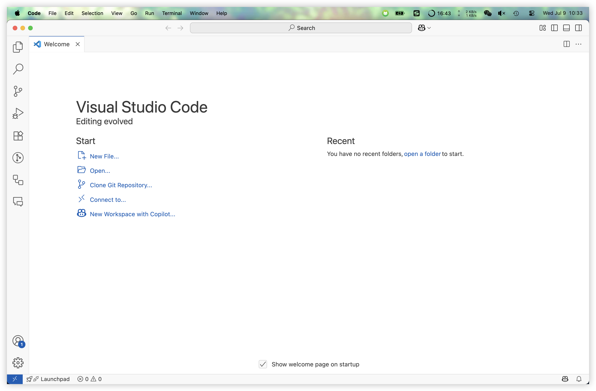
</p>

#### 拓展安装
VS本体还无法直接编辑运行Julia、MATLAB、Python等代码，需要安装对应的拓展（Extension）。可以使用`Ctrl+Shift+X`快捷键打开拓展窗口，或是直接点击最左边栏中的“四格方块图标”。
>**说明**：在MacOS中，Windows系统下的快捷键`Ctrl`通常对应`Command`。

<p align = "center">   
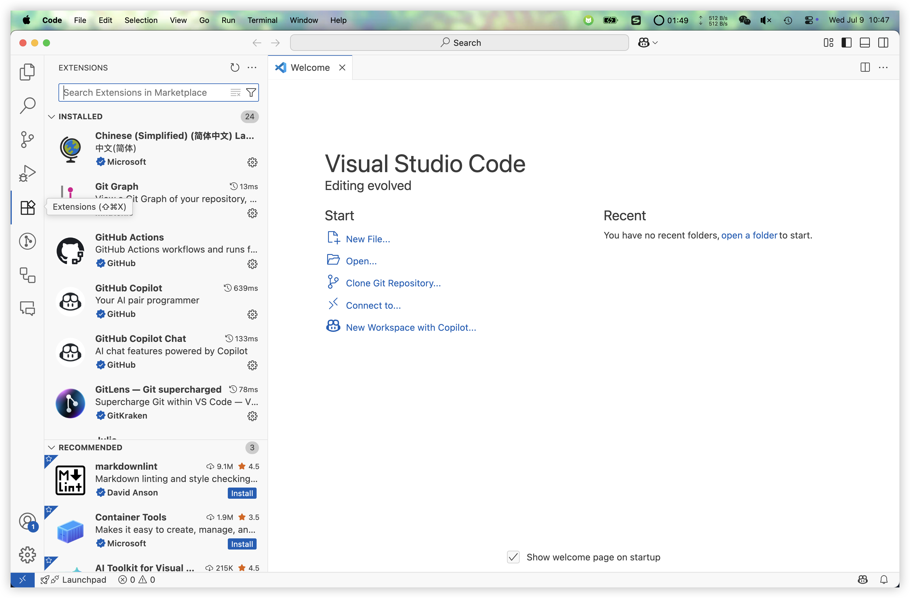
</p>

学习本项目需要安装以下拓展：
1. Julia
2. MATLAB
3. stataRUN
4. LaTeX Workshop
5. GitHub Copilot和GitHub Copilot Chat
6. GitLens — Git supercharged和Git Graph

> **说明**：VS仅仅是“代码编辑器”，本身并没有运行代码的功能。MATLAB、Stata代码仍然是在其软件中运行。Julia、Python等代码则运行在终端（Terminal）中。

#### 使用VS Code打开项目
VS Code以项目为单位管理文件，一般包含论文的数据、代码和Beamer等文件。首先在电脑的任意位置新建一个项目文件夹，并右键使用VS Code打开。

> **注意**：MacOS右键菜单中没有“使用VS Code打开”选项。需要先在App Store中下载“超级右键”软件，并在软件中勾选。
> <p align = "center">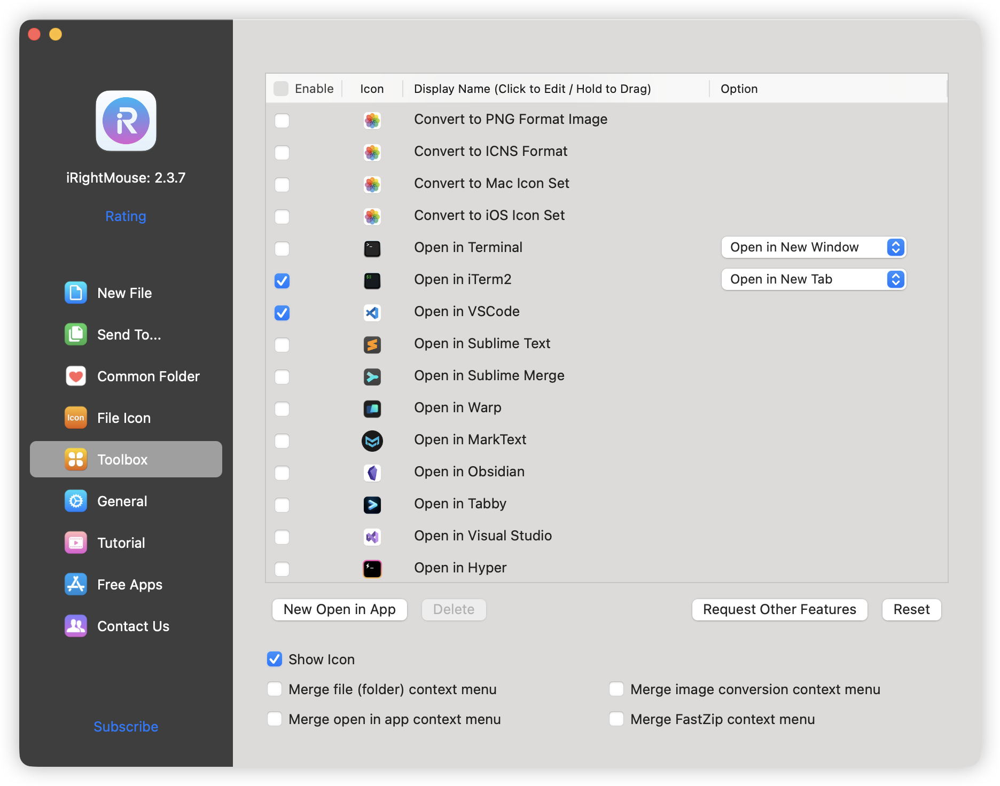</p>

打开项目后，可以在“Explorer”中查看项目文件夹中的所有文件。可以通过两种方式在项目中创建新文件：
1. 将鼠标移至项目名称上，会出现“创建文件”、“创建文件夹”按钮。
   <p align = "center">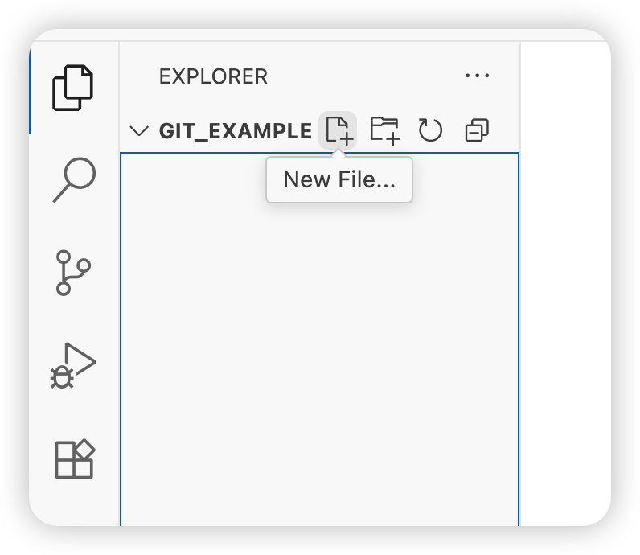</p>
2. 使用快捷键`Control+Shift+P`激活功能候选框并选择`Create: New File...`），在上方弹出的窗口中输入`.m`，选择文件保存目录并命名。
   <p align = "center">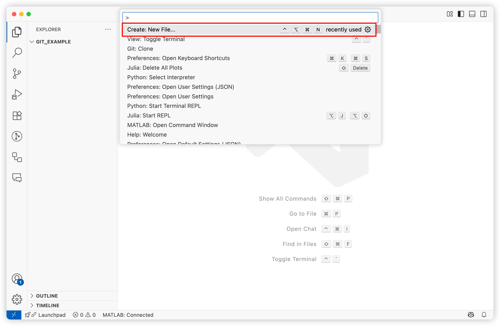</p>

### 安装MATLAB
MATLAB（Matrix Laboratory）是美国MathWorks公司出品的商业数学软件。结构模型涉及繁杂的非线性方程组求解，需要使用MATLAB进行数据处理和迭代求解。
#### 软件安装
MATLAB是付费的商业软件，可以在[中财校园信息门户](https://i.cufe.edu.cn/ywtb-portal/standardcufe/index.html#/cufehome)中找到[正版化平台](https://msca.webvpn.cufe.edu.cn/)，在[MATLAB专区](https://msca.webvpn.cufe.edu.cn/index/matlab)中安装对应操作系统的正版软件。
<p align = "center">   

</p>

> **注意**：使用**盗版MATLAB**将无法联网安装外部工具箱。在搭载M系列芯片的MacBook上，应安装“MacOS(Apple silicon)版本”，以获取最好的兼容性与速度。<p align = "center">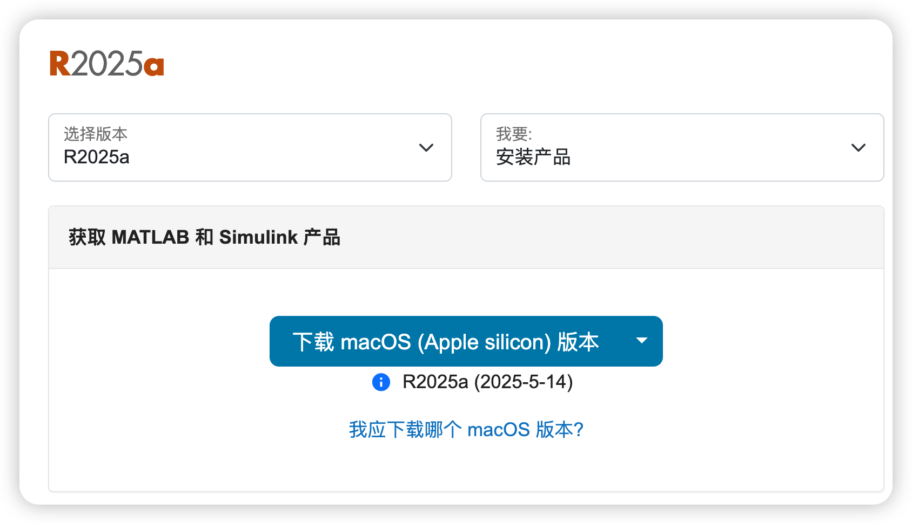</p>

按照指引，登录中财校园邮箱账号
<p align = "center">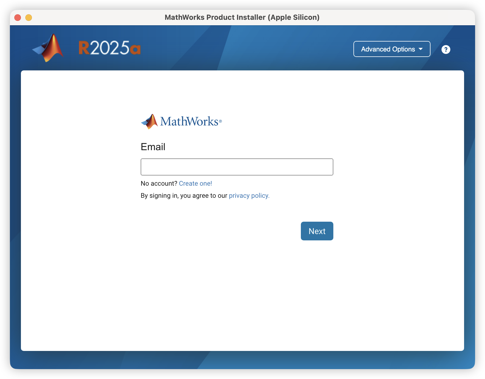</p>

> **说明**：中财校园邮箱账号通常为“学号@email.cufe.edu.cn”。可在[中财校园信息门户](https://i.cufe.edu.cn/ywtb-portal/standardcufe/index.html#/cufehome)中找到“邮箱”，并进行初始化设置。设置好校园邮箱后，还需要[**前往MathWorks官网创建账户**](https://ww2.mathworks.cn/?s_tid=user_nav_logo)。

在产品选择页面，仅需勾选“MATLAB”本体和“Optimization Toolbox”。点击下一步，等待安装即可。
<p align = "center">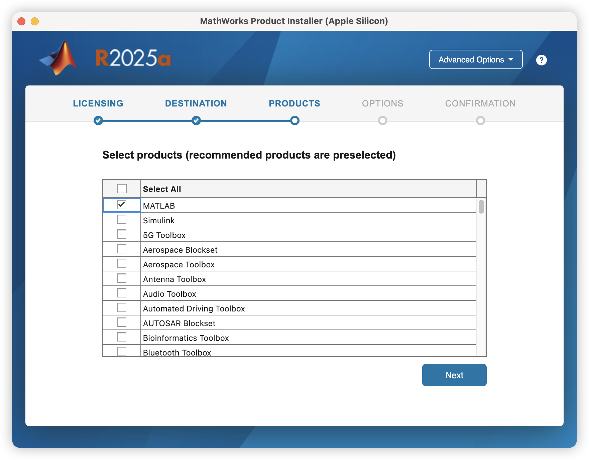</p>

#### 安装工具包（Add-Ones）
和Stata一样，MATLAB的部分功能/函数需要额外安装。在MATLAB主界面工具栏中选择“Add-Ones”→“Explore Add-Ones”中搜索`Hatchfill2`，按照指引安装。还可以直接在左侧边栏点击“三个方块堆叠”图标，搜索并安装。
<p align = "center">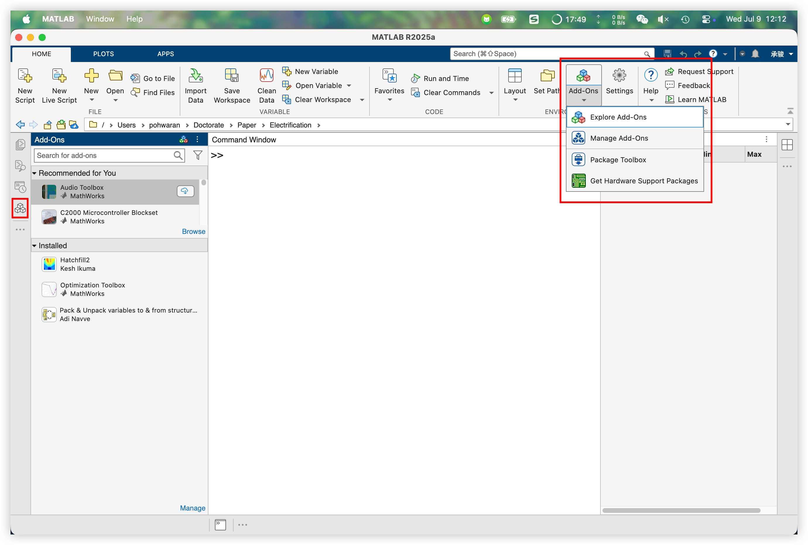</p>

#### 在VS Code中配置MATLAB
在VS Code中编写MATLAB代码，可以很方便地调用GitHub Copilot进行AI辅助。
1. 首先，确保已经[安装MATLAB官方拓展](#拓展安装)。
2. 进入MATLAB拓展的设置，在`MATLAB: Install Path`模块中输入本地MATLAB的路径。

<p align = "center">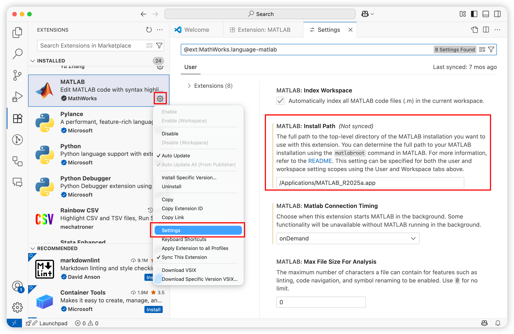</p>

#### 在VS Code中编辑和运行MATLAB代码
直接在VS Code中打开已有的MATLAB代码文件（后缀为`.m`），或[创建新文件](#使用vs-code打开项目)。
1. 在创建的新文件中输入MATLAB代码，选中并使用快捷键`Shift+Enter`运行命令。这将呼出VS Code自带的终端，第一次运行需要等待软件启动。
2. 在终端中输入`desktop`并按`Enter`，可呼出MATLAB软件主界面，方便查看变量内容。

<p align = "center">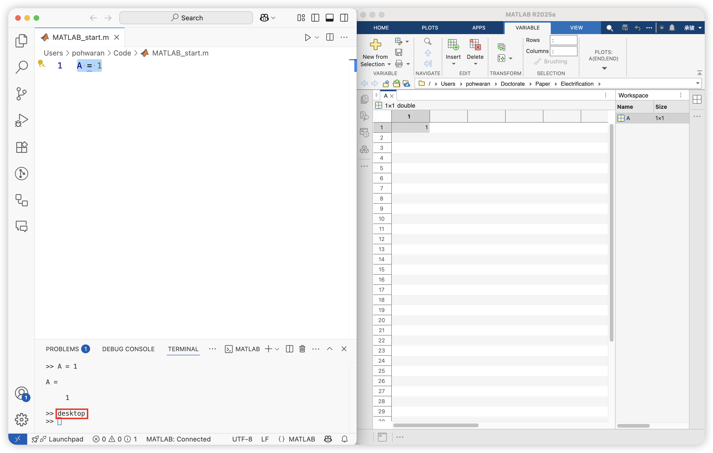</p>

> **说明**：建议按照上图布置工作区。一侧为VS Code，包括代码编辑窗口和运行结果查看窗口；另一侧为MATLAB主窗口，但仅保留变量列表与变量查看。


### 安装Git
在编写项目代码时，我们通常会遇到以下问题：
1. 需要对代码进行修改，但又想备份原有文件
2. 模型有几种版本，不同版本代码需要重命名，且都堆砌在同一个项目目录
3. 需要与他人分享代码，只能以压缩包形式通过网盘或微信传递，不易于协作编写代码

Git 是一个开源分布式版本控制系统，用于管理和跟踪代码或文件的变更。它可以记录文件的每一次修改，帮助开发者协作、管理代码版本、追踪项目历史，并在需要时恢复到之前的版本。

#### 软件安装
Windows系统可在[Git官网](https://git-scm.com/downloads/win)下载安装包，一般选择“Git for Windows/x64 Setup”，全部按照默认设置。MacOS一般自带Git，可在终端中运行`git --version`查看当前版本。
<p align = "center">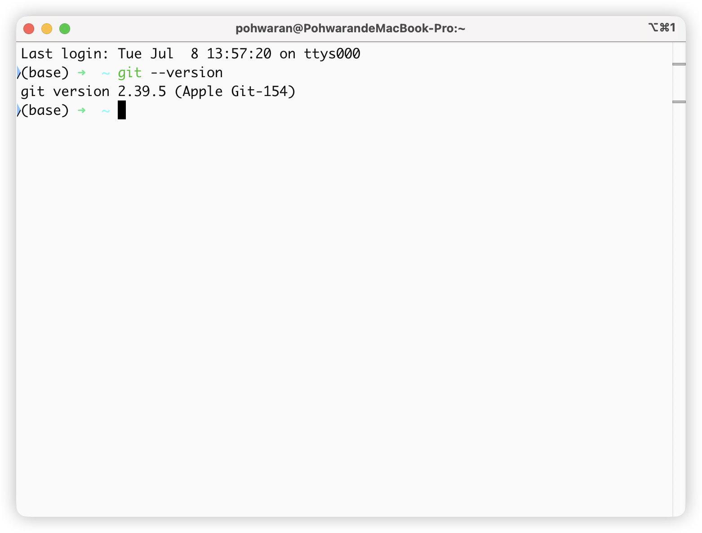</p>
如果没有安装，可以在终端通过Homebrew安装Git。如果没有安装Homebrew，则先在终端运行下列命令安装。

```
/bin/bash -c "$(curl -fsSL https://raw.githubusercontent.com/Homebrew/install/HEAD/install.sh)"
```
然后使用Homebrew安装Git
```
brew install git
```
> 注意：如果因网络问题无法连接github，需要先按照[梯子Clash]配置网络工具。

#### 配置Git
第一次使用Git前，需要运行以下命令配置`用户名`和`邮箱`
```
git config --global user.name "your name"
git config --global user.email "your.email@example.com"
```

#### Git基础原理
Git的工作原理基于三个主要概念：
1. 工作区（Working Directory），是你实际编辑代码的地方
2. 暂存区（Staging Area），是一个临时区域，用于保存即将提交的更改
3. 版本库（Repository），是保存所有提交记录的地方。用户可以随时从版本库中恢复工作区的状态。
<p align = "center">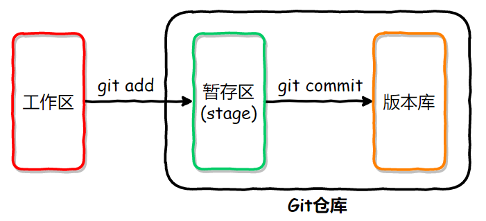</p>

在进行项目编辑时，无论我们的项目有多少个版本，本地（工作区）的文件都只有一个（版本）。\
版本库中的信息以**分支（Branch）** 和 **节点（Commit）** 的形式组织。每次提交都会创建一个新的节点。分支是指向特定节点的指针，可以在不同分支之间切换。\
下图是[电气化项目]的Git分支结构示意图。可以看到该项目有5条不同的分支（Branch），不同的分支的节点（Commit）数量也不同。
<p align = "center">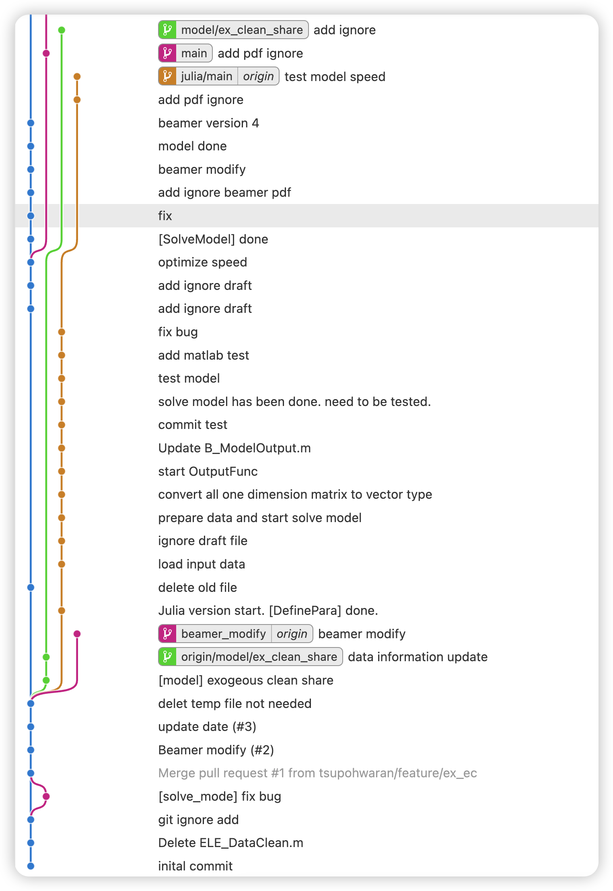</p>

#### 创建Git仓库
首先介绍如何在本地创建一个Git仓库。
1. [创建GitHub账号](https://github.com/)，并在VS Code软件左下角中登录Github账号
2. [使用VS Code打开任意项目文件夹](#使用vs-code打开项目)，在其中新建一个`.m`文件，随意输入一些命令，如`disp('Hello World');`

3. 使用快捷键`Ctrl+Shift+P`呼出功能区，输入或选择`View: Toggle Terminal`呼出终端。如果呼出的是MATLAB终端，则点击旁边的`+`创建一个新终端
<p align = "center">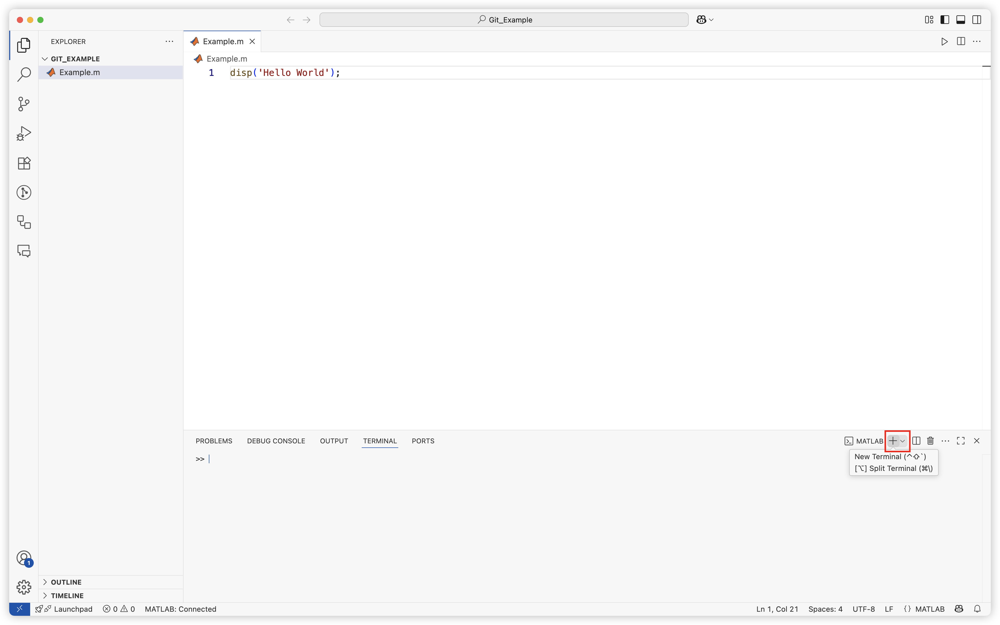</p>

4. 在终端中输入`git init`，初始化Git仓库。这将在项目文件夹中创建一个名为`.git`的隐藏文件夹。终端信息提示“已经初始化了一个空的Git仓库”。
<p align = "center">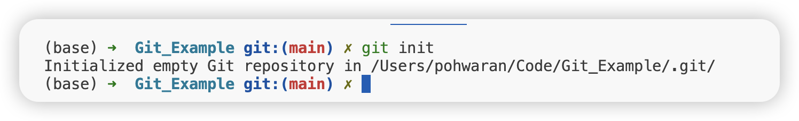</p>

#### 开始通过Git追踪代码版本
Git仓库创建后，我们可以将代码提交到Git仓库中。提交代码的过程包括将文件添加到暂存区和提交到版本库。
1. 输入`git add .`将项目文件下的**所有的**文件加入到暂存区中。如果只想添加特定文件，可以将`.`替换为文件名。
2. 在终端中输入`git commit -m "Initial commit"`。这将把暂存区的更改提交到Git仓库，并添加提交注释"Initial commit"。提交注释应简洁明了，描述本次提交的内容。
3. 在[安装Git Graph拓展](#拓展安装)后，点击VS Code最下方的“Git Graph”即可可视化查看Git仓库的提交历史和分支结构。可以看到，目前我们已经有了一个节点，且所在分支为`main`。此外，还记录了提交注释、时间、提交者以及每个节点的SHA-1哈希值。
<p align = "center">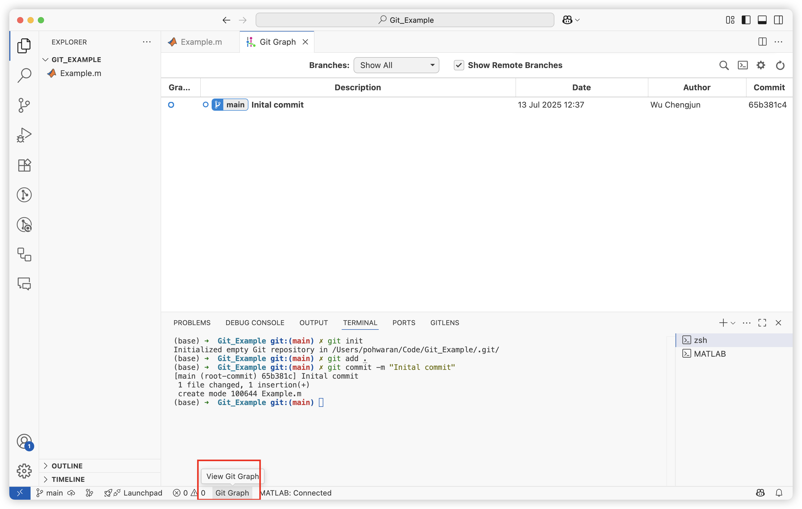</p>

#### 代码更改后，找回之前的版本
首先对现有代码进行修改，比如在`.m`文件中添加一行代码`disp('Hello Git');`，并使用快捷键`Ctrl+S`保存文件更改。如果此时已经安装过“GitLens”插件，将会在代码左侧看到一个绿色竖线标识，提示这是新增的代码。点击该竖线标识，可以快捷对比历史版本。
<p align = "center">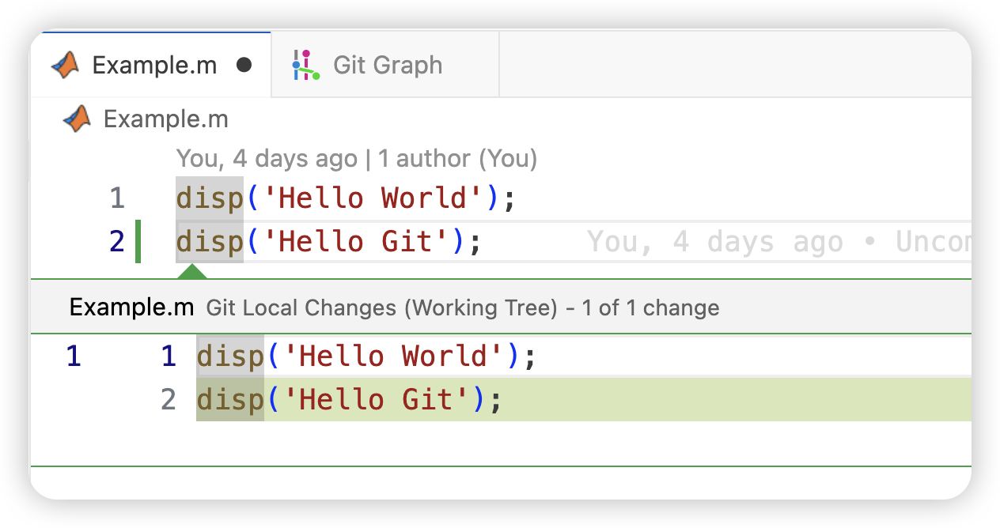</p>

在VS Code左侧边栏中点击“Source Control”图标（或使用快捷键`Ctrl+Shift+G`），可以看到当前工作区的Git状态。点击该文件，也可以查看具体的更改内容。\
在“Source Control”面板中：
1. 点`+`按钮可以将文件添加到暂存区（等同于`git add Example.m`）
2. 在`Messages`输入框中输入提交注释后点击`√Commit`按钮提交更改。等同于`git commit -a -m "注释"`，将跳过提交到暂存区的步骤，直接提交更改到版本库。
<p align = "center">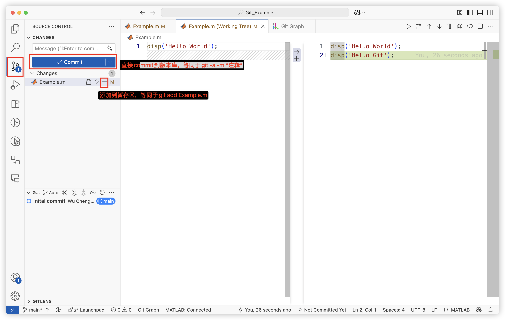</p>

> **注意**：如果通过`√Commit`按钮提交更改，则按钮会变为`Publish Changes`，表示将本地更改推送到远程仓库(GitHub)。我们将在后续介绍如何创建和使用远程仓库。

提交更改后，可以在“Git Graph”中看到新的节点。点击该节点和文件名，可以查看本次提交的详细信息和更改内容。
<p align = "center">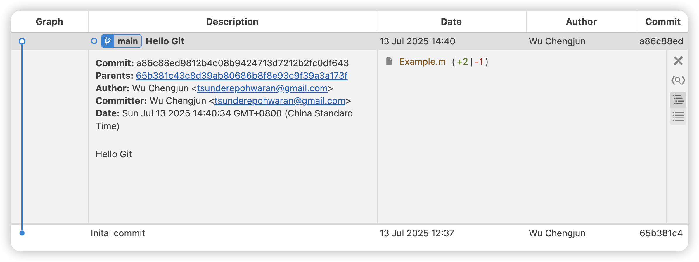</p>

如果想找回之前的版本，可以在“Git Graph”中右键点击某个节点，选择“Checkout”。这将切换到该节点对应的代码版本。这等同于在终端中输入`git checkout <commit-hash>`，其中`<commit-hash>`是节点的SHA-1哈希值。\
如果想回到最新的版本：
1. 可以在“Git Graph”中右键点击最新节点，选择“Checkout”。这将切换回最新的代码版本。
2. 在终端中输入`git checkout main`，切换回`main`分支的最新版本。
3. 在终端中输入`git checkout <commit-hash>`，其中`<commit-hash>`是最新节点的SHA-1哈希值。

> **注意**：在“Git Graph”中右键点击该节点，选择`Reset current branch to this commit`，将重置当前分支到该节点，并删除之后的所有节点。\
> **注意**：重置分支会删除之后的所有提交，操作不可逆。请谨慎操作。

#### 创建和切换分支
分支是Git中用于管理不同版本代码的机制。可以在不同分支上进行独立的开发和修改，例如APP开发可能会有开发者版、内侧版等多个版本。各个版本同时开发，但不会影响主版本（`main`）。\
可以通过多种方式创建分支：
1. 在“Git Graph”中右键点击某个节点，选择`Create Branch`，在弹出的窗口中输入新分支的名称。
<p align = "center">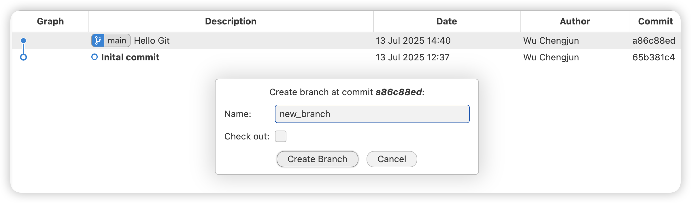</p>

2. 在终端中输入`git branch <branch-name>`，创建一个新分支。其中`<branch-name>`是新分支的名称。

在创建分支后，我们提交新更改时，默认仍然是在当前分支（main）上进行。如果想在新分支上进行开发，需要切换到该分支。两种方式：
1. 在“Git Graph”中右键点击某个分支，选择`Checkout this branch`。
2. 在终端中输入`git checkout <branch-name>`，切换到指定分支。
> **说明**：如果想在创建分支的同时切换到该分支，可以在终端中输入`git checkout -b <branch-name>`。或者在“Git Graph”中创建分支时勾选“Check out”。
