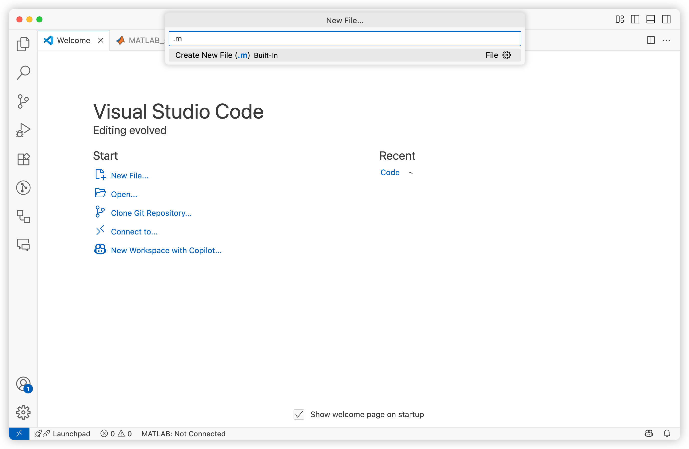

## 环境配置
### 安装Visual Studio Code
Visual Studio Code 是由微软开发能够在 Windows、 Linux 和 macOS 等操作系统上运行的**免费**代码编辑神器。它支持**AI辅助编程**、语法高亮、自动补全、多点编辑、运行调试等一系列便捷功能，而且能够支持Julia、MATLAB、Python、Stata、Latex在内的多种语言。
#### 软件安装
大家可以在[软件官网](https://code.visualstudio.com/)下载对应操作系统的安装包。选择默认设置，打开即可。初始打开的标签页为“Welcome”。其中“Start”中可以创建新代码文件（New File）、打开已有项目（Open）或是从Github中克隆项目到本地（Clone Git Repository）；“Recent”记录了用户最近打开的项目，点击可直接打开。

   

#### 拓展安装
VS本体还无法直接编辑运行Julia、MATLAB、Python等代码，需要安装对应的拓展（Extension）。可以使用`Ctrl+Shift+X`快捷键打开拓展窗口，或是直接点击最左边栏中的“四格方块图标”。
>**说明**：在MacOS中，Windows系统下的快捷键`Ctrl`通常对应`Command`。

学习本项目需要安装以下拓展：
1. Julia
2. MATLAB
3. stataRUN
4. LaTeX Workshop
5. GitHub Copilot和GitHub Copilot Chat
6. GitLens — Git supercharged和Git Graph

> **说明**：VS仅仅是“代码编辑器”，本身并没有运行代码的功能。MATLAB、Stata代码仍然是在其软件中运行。Julia、Python等代码则运行在终端（Terminal）中。

### 安装MATLAB
MATLAB（Matrix Laboratory）是美国MathWorks公司出品的商业数学软件。结构模型涉及繁杂的非线性方程组求解，需要使用MATLAB进行数据处理和迭代求解。
#### 软件安装
MATLAB是付费的商业软件，可以在[中财校园信息门户](https://i.cufe.edu.cn/ywtb-portal/standardcufe/index.html#/cufehome)中找到[正版化平台](https://msca.webvpn.cufe.edu.cn/)，在[MATLAB专区](https://msca.webvpn.cufe.edu.cn/index/matlab)中安装对应操作系统的正版软件。

   

> **注意**：在打在M系列芯片的MacBook上，应安装“MacOS(Apple silicon)版本”，以获取最好的兼容性与速度。

按照指引，登录中财校园邮箱账号

> **说明**：中财校园邮箱账号通常为“学号@email.cufe.edu.cn”。可在[中财校园信息门户](https://i.cufe.edu.cn/ywtb-portal/standardcufe/index.html#/cufehome)中找到“邮箱”，并进行初始化设置。设置好校园邮箱后，还需要[**前往MathWorks官网创建账户**](https://ww2.mathworks.cn/?s_tid=user_nav_logo)。

在产品选择页面，仅需勾选“MATLAB”本体和“Optimization Toolbox”。点击下一步，等待安装即可。

#### 安装工具包（Add-Ones）
和Stata一样，MATLAB的部分功能/函数需要额外安装。在MATLAB主界面工具栏中选择“Add-Ones”→“Explore Add-Ones”中搜索`Hatchfill2`，按照指引安装。还可以直接在左侧边栏点击“三个方块堆叠”图标，搜索并安装。

#### 在VS Code中配置MATLAB
在VS Code中编写MATLAB代码，可以很方便地调用GitHub Copilot进行AI辅助。
1. 首先，确保已经按照[拓展安装](#拓展安装)安装MATLAB官方拓展。
2. 进入MATLAB拓展的设置，在`MATLAB: Install Path`模块中输入本地MATLAB的路径。

#### 在VS Code中编辑和运行MATLAB代码
直接在VS Code中打开已有的MATLAB代码文件（后缀为`.m`），或创建新文件。
1. 在“Welcome”标签页点击“New File”（或使用快捷键`Control+Shift+P`激活功能候选框并选择`Create: New File...`），在上方弹出的窗口中输入`.m`，选择文件保存目录并命名。

1. 在创建的新文件中输入MATLAB代码，选中并使用快捷键`Shift+Enter`运行命令。这将呼出VS Code自带的终端，第一次运行需要等待软件启动。
2. 在终端中输入`desktop`并按`Enter`，可呼出MATLAB软件主界面，并方便查看变量内容。

> **说明**：建议按照上图布置工作区。一侧为VS Code，包括代码编辑窗口和运行结果查看窗口；另一侧为MATLAB主窗口，但仅保留变量列表与变量查看。

### 安装Git
在编写项目代码时，我们通常会遇到以下问题：
1. 需要对代码进行修改，但又想备份原有文件
2. 模型有几种版本，不同版本代码需要重命名，且都堆砌在同一个项目目录
3. 需要与他人分享代码，只能以压缩包形式通过网盘或微信传递，不易于协作编写代码

Git 是一个分布式版本控制系统，用于管理和跟踪代码或文件的变更。它可以记录文件的每一次修改，帮助开发者协作、管理代码版本、追踪项目历史，并在需要时恢复到之前的版本。